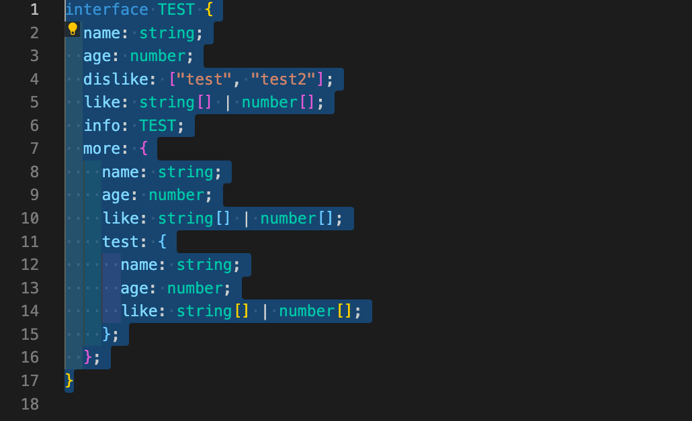
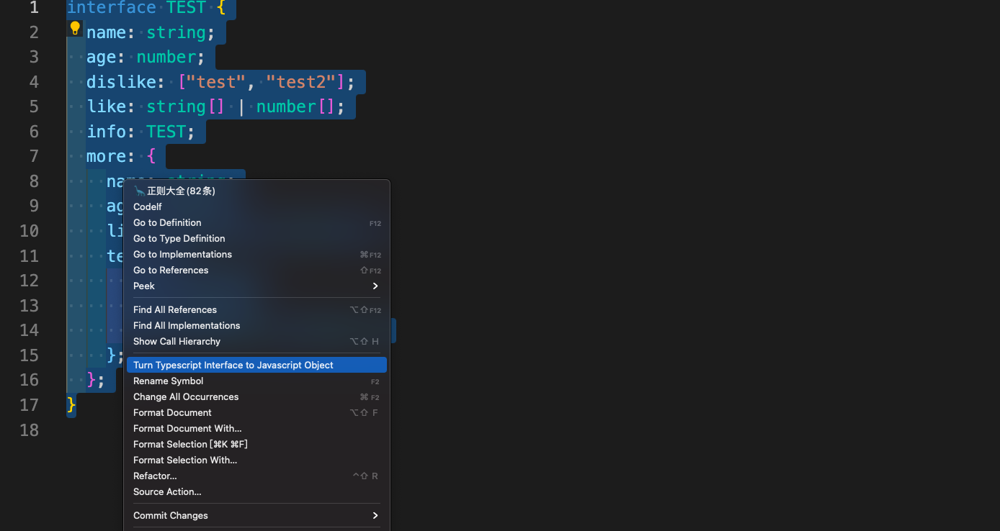

# Turn Typescript Interface to Javascript Object

## Only support Interface

``` typescript

// some interface definition you have
interface TEST {
  name: string;
  age: number;
  dislike: ["test", "test2"];
  like: string[] | number[];
  info: TEST;
  more: {
    name: string;
    age: number;
    like: string[] | number[];
    test: {
      name: string;
      age: number;
      like: string[] | number[];
    };
  };
};

// this plugin will generate it to javascript object with initial default value
const test = {name: "",age: 0,dislike: [],like: [],info: {},more: {
    name: string;
    age: number;
    like: string[] | number[];
    test: {
      name: string;
      age: number;
      like: string[] | number[];
    };
  },}
```

## How to use

- simply select your interface code


- right click
- choose [Turn Typescript Interface to Javascript Object] command in the context menu


- That's it! 
## TODO

- interface / type in interface

## License

[MIT](./LICENSE) License © 2022
